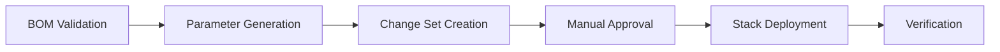

# BOM-Driven AWS Infrastructure Solution

## 🎯 Solution Overview

This is a complete, production-ready solution for deploying AWS infrastructure using a **Bill of Materials (BOM) CSV file** as the single source of truth. The solution provides enterprise-grade automation with manual approval gates and OIDC-based security.

## 🏗️ Architecture

```
┌─────────────────┐    ┌──────────────────┐    ┌─────────────────┐
│   BOM CSV       │───▶│  GitHub Actions  │───▶│  CloudFormation │
│ (Single Source  │    │  (OIDC + Manual  │    │  (Modular       │
│  of Truth)      │    │   Approval)      │    │   Stacks)       │
└─────────────────┘    └──────────────────┘    └─────────────────┘
         │                        │                        │
         │                        │                        │
         ▼                        ▼                        ▼
┌─────────────────┐    ┌──────────────────┐    ┌─────────────────┐
│ • VPC/Subnets   │    │ • No Access Keys │    │ • Network Stack │
│ • EC2 Instances │    │ • Branch Control │    │ • Compute Stack │
│ • RDS Databases │    │ • Manual Gates   │    │ • Storage Stack │
│ • S3 Buckets    │    │ • Audit Trail    │    │ • Database Stack│
└─────────────────┘    └──────────────────┘    └─────────────────┘
```

## 📁 Project Structure

```
aws-bom-infrastructure/
├── 📋 bom/                          # BOM CSV files
│   └── customer-bom.csv             # Sample BOM configuration
├── ☁️ cloudformation/               # CloudFormation templates
│   ├── network-stack.yaml           # VPC, subnets, gateways
│   ├── compute-stack.yaml           # EC2 instances, security groups
│   ├── storage-stack.yaml           # S3 buckets, policies
│   └── database-stack.yaml          # RDS instances, monitoring
├── 🔐 iam/                          # IAM role setup
│   └── setup-oidc-role.yaml         # OIDC trust policy
├── 🤖 .github/workflows/            # GitHub Actions
│   └── deploy-infrastructure.yml    # Main deployment workflow
├── 🛠️ scripts/                      # Automation scripts
│   ├── parse-bom.py                 # BOM parser (Python)
│   ├── deploy-local.sh              # Local deployment (Bash)
│   └── deploy-local.ps1             # Local deployment (PowerShell)
├── 📚 docs/                         # Documentation
│   ├── DEPLOYMENT_GUIDE.md          # Comprehensive deployment guide
│   └── BOM_SCALING_EXAMPLES.md      # Real-world scaling scenarios
├── 🚀 QUICK_START.md                # 15-minute setup guide
└── 📖 README.md                     # Project overview
```

## 🎯 Key Features

### ✅ BOM-Driven Deployment
- **Single CSV file** defines entire infrastructure
- **Incremental scaling** without pipeline changes
- **Enable/disable resources** with boolean flags
- **Version controlled** infrastructure definitions

### ✅ Enterprise Security
- **OIDC authentication** (no AWS access keys)
- **Repository and branch restrictions**
- **Manual approval gates** for all deployments
- **Least privilege IAM permissions**

### ✅ Production Ready
- **Modular CloudFormation** templates
- **Dependency management** between stacks
- **Rollback on failure** with change sets
- **Comprehensive logging** and monitoring

### ✅ Developer Experience
- **Local testing** with validation scripts
- **Dry run mode** for safe testing
- **Clear error messages** and troubleshooting
- **Cross-platform support** (Windows/Linux/macOS)

## 🚀 Quick Start (15 minutes)

### 1. Deploy OIDC Role (5 min)
```bash
aws cloudformation deploy \
  --template-file iam/setup-oidc-role.yaml \
  --stack-name github-actions-oidc-role \
  --parameter-overrides GitHubRepository="your-org/repo" \
  --capabilities CAPABILITY_NAMED_IAM \
  --region eu-north-1
```

### 2. Configure GitHub Environment (2 min)
- Create `production` environment in GitHub
- Add required reviewers for approval

### 3. Customize BOM File (3 min)
```csv
resource_type,resource_name,environment,stack_name,cidr_block,instance_type,storage_size,enabled,region,description
vpc,main-vpc,production,network-stack,10.0.0.0/16,,,true,eu-north-1,Main VPC
ec2,web-server-1,production,compute-stack,,t3.medium,40,true,eu-north-1,Web server
s3,app-storage,production,storage-stack,,,,true,eu-north-1,Storage bucket
```

### 4. Deploy Infrastructure (5 min)
- Run GitHub Actions workflow
- Review change sets
- Approve deployment

## 📈 Scaling Examples

### Initial Deployment
```csv
# Minimal setup
vpc,main-vpc,production,network-stack,10.0.0.0/16,,,true,eu-north-1,Main VPC
ec2,web-server-1,production,compute-stack,,t3.medium,40,true,eu-north-1,Web server
```

### Scale to High Availability
```csv
# Add multi-AZ setup
vpc,main-vpc,production,network-stack,10.0.0.0/16,,,true,eu-north-1,Main VPC
subnet,public-subnet-1a,production,network-stack,10.0.1.0/24,,,true,eu-north-1,Public subnet AZ-a
subnet,public-subnet-1b,production,network-stack,10.0.2.0/24,,,true,eu-north-1,Public subnet AZ-b
ec2,web-server-1,production,compute-stack,,t3.medium,40,true,eu-north-1,Web server AZ-a
ec2,web-server-2,production,compute-stack,,t3.medium,40,true,eu-north-1,Web server AZ-b
```

### Add Database Tier
```csv
# Include RDS database
rds,app-database,production,database-stack,,db.t3.micro,20,true,eu-north-1,MySQL database
```

## 🔧 Local Development

### Validate BOM
```bash
python scripts/parse-bom.py bom/customer-bom.csv --validate-only
```

### Test Deployment (Dry Run)
```bash
./scripts/deploy-local.sh --bom-file bom/customer-bom.csv --dry-run
```

### Deploy Locally
```bash
./scripts/deploy-local.sh --bom-file bom/customer-bom.csv --environment production
```

## 🎛️ BOM Configuration

### Required Columns
| Column | Description | Example |
|--------|-------------|---------|
| `resource_type` | AWS resource type | `vpc`, `ec2`, `rds`, `s3` |
| `resource_name` | Unique resource name | `main-vpc`, `web-server-1` |
| `environment` | Environment name | `production`, `staging` |
| `stack_name` | CloudFormation stack | `network-stack`, `compute-stack` |
| `enabled` | Deploy resource | `true`, `false` |

### Optional Columns
| Column | Description | Example |
|--------|-------------|---------|
| `cidr_block` | Network CIDR | `10.0.0.0/16` |
| `instance_type` | EC2/RDS instance type | `t3.medium`, `db.t3.micro` |
| `storage_size` | Storage size in GB | `40`, `20` |
| `region` | AWS region | `eu-north-1` |
| `description` | Human-readable description | `Main VPC for production` |

## 🔒 Security Features

### OIDC Authentication
- No AWS access keys in GitHub
- Repository-specific trust policy
- Branch-level access control

### Manual Approval Gates
- Required approval before deployment
- Change set review process
- Audit trail for all deployments

### Least Privilege IAM
- Minimal required permissions
- Resource-specific access patterns
- CloudFormation service roles

## 📊 Monitoring & Observability

### CloudFormation Integration
- Change sets for safe deployments
- Stack drift detection
- Resource tagging for governance

### Cost Management
- Resource tagging for cost allocation
- S3 lifecycle policies
- Right-sizing recommendations in BOM

### Operational Excellence
- CloudWatch monitoring enabled
- Enhanced monitoring for RDS
- Performance Insights for databases

## 🌍 Multi-Environment Support

### Environment Separation
```csv
# Production BOM
vpc,prod-vpc,production,network-stack,10.0.0.0/16,,,true,eu-north-1,Production VPC

# Staging BOM  
vpc,staging-vpc,staging,network-stack,10.1.0.0/16,,,true,eu-north-1,Staging VPC
```

### Region Support
- Primary region: `eu-north-1`
- Disaster recovery: `us-west-2`
- Multi-region deployment patterns

## 🔄 CI/CD Integration

### GitHub Actions Workflow
1. **Validate** BOM file syntax and logic
2. **Generate** CloudFormation parameters
3. **Create** change sets for review
4. **Manual approval** gate
5. **Execute** change sets in dependency order
6. **Monitor** deployment progress
7. **Report** deployment results

### Deployment Stages


## 📋 Compliance & Governance

### Tagging Strategy
- `Project`: BOM-Infrastructure
- `Environment`: production/staging/development
- `Owner`: GitHub repository
- `DeployedBy`: GitHub Actions
- `Timestamp`: Deployment time

### Backup & Recovery
- RDS automated backups (7 days)
- S3 versioning enabled
- CloudFormation stack protection
- Infrastructure as Code versioning

## 🎓 Best Practices

### BOM Management
1. **Version control** all BOM files
2. **Test in staging** before production
3. **Incremental changes** for safety
4. **Descriptive naming** conventions
5. **Regular cost reviews**

### Security
1. **Rotate OIDC thumbprints** annually
2. **Review IAM permissions** quarterly
3. **Monitor CloudTrail** for access
4. **Enable GuardDuty** for threat detection

### Operations
1. **Monitor stack drift** weekly
2. **Review change sets** carefully
3. **Test rollback procedures** regularly
4. **Document custom configurations**

## 🆘 Troubleshooting

### Common Issues
- **BOM validation errors**: Check CSV format and required fields
- **OIDC authentication failures**: Verify repository name and branch
- **CloudFormation failures**: Check service limits and permissions
- **Resource conflicts**: Ensure unique naming across environments

### Support Resources
- [AWS CloudFormation Documentation](https://docs.aws.amazon.com/cloudformation/)
- [GitHub Actions OIDC Guide](https://docs.github.com/en/actions/deployment/security-hardening-your-deployments/about-security-hardening-with-openid-connect)
- [AWS Well-Architected Framework](https://aws.amazon.com/architecture/well-architected/)

## 🚀 Future Enhancements

### Planned Features
- **Auto-scaling groups** support in BOM
- **Application Load Balancer** configurations
- **Lambda functions** deployment
- **ECS/Fargate** container support
- **Cost optimization** recommendations

### Integration Opportunities
- **Terraform** backend support
- **Ansible** configuration management
- **Datadog/New Relic** monitoring
- **Slack/Teams** notifications

---

## 📞 Getting Started

Ready to deploy your BOM-driven infrastructure?

1. 📖 Read the [Quick Start Guide](QUICK_START.md)
2. 📚 Review the [Deployment Guide](docs/DEPLOYMENT_GUIDE.md)
3. 📈 Explore [Scaling Examples](docs/BOM_SCALING_EXAMPLES.md)
4. 🚀 Deploy your first infrastructure!

**Target Environment**: AWS Account `588681235095`, Region `eu-north-1`

This solution provides enterprise-grade infrastructure automation with the simplicity of a CSV file. Scale from a single EC2 instance to a multi-region, highly available architecture using the same BOM-driven approach.