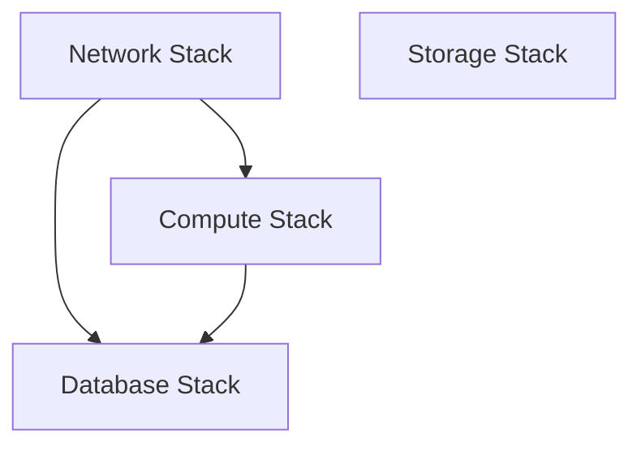

# BOM-Driven Infrastructure Deployment Guide

This guide walks you through deploying AWS infrastructure using the BOM (Bill of Materials) driven approach.

## Prerequisites

1. **AWS Account**: Access to AWS Account ID `588681235095`
2. **GitHub Repository**: Fork or clone this repository
3. **IAM Role**: Deploy the OIDC IAM role (one-time setup)
4. **Permissions**: Admin access to configure GitHub Actions

## One-Time Setup

### 1. Deploy OIDC IAM Role

First, deploy the IAM role that GitHub Actions will assume:

```bash
# Deploy the OIDC role CloudFormation template
aws cloudformation deploy \
  --template-file iam/setup-oidc-role.yaml \
  --stack-name github-actions-oidc-role \
  --parameter-overrides \
    GitHubRepository="your-org/aws-bom-infrastructure" \
    GitHubBranch="main" \
  --capabilities CAPABILITY_NAMED_IAM \
  --region eu-north-1
```

### 2. Configure GitHub Repository

1. **Update Repository Parameter**: Edit `iam/setup-oidc-role.yaml` and update the `GitHubRepository` parameter to match your repository
2. **Set GitHub Environment**: Create a GitHub environment named `production` with required reviewers for manual approval

## BOM File Structure

The BOM CSV file defines your infrastructure. Here's the structure:

| Column | Description | Example |
|--------|-------------|---------|
| `resource_type` | Type of AWS resource | `vpc`, `subnet`, `ec2`, `s3`, `rds` |
| `resource_name` | Unique name for the resource | `main-vpc`, `web-server-1` |
| `environment` | Environment name | `production`, `staging` |
| `stack_name` | CloudFormation stack name | `network-stack`, `compute-stack` |
| `cidr_block` | CIDR for network resources | `10.0.0.0/16` |
| `instance_type` | EC2/RDS instance type | `t3.medium`, `db.t3.micro` |
| `storage_size` | Storage size in GB | `40`, `20` |
| `enabled` | Whether to deploy | `true`, `false` |
| `region` | AWS region | `eu-north-1` |
| `description` | Resource description | Human-readable description |

### Sample BOM Entry

```csv
resource_type,resource_name,environment,stack_name,cidr_block,instance_type,storage_size,enabled,region,description
vpc,main-vpc,production,network-stack,10.0.0.0/16,,,true,eu-north-1,Main VPC for production
ec2,web-server-1,production,compute-stack,,t3.medium,40,true,eu-north-1,Primary web server
```

## Deployment Process

### 1. Update BOM File

Edit `bom/customer-bom.csv` with your desired infrastructure:

```csv
resource_type,resource_name,environment,stack_name,cidr_block,instance_type,storage_size,enabled,region,description
vpc,main-vpc,production,network-stack,10.0.0.0/16,,,true,eu-north-1,Main VPC
subnet,public-subnet-1a,production,network-stack,10.0.1.0/24,,,true,eu-north-1,Public subnet AZ-a
ec2,web-server-1,production,compute-stack,,t3.medium,40,true,eu-north-1,Web server
s3,app-storage,production,storage-stack,,,,true,eu-north-1,Application storage
```

### 2. Run GitHub Actions Workflow

1. Go to **Actions** tab in your GitHub repository
2. Select **Deploy BOM-driven AWS Infrastructure** workflow
3. Click **Run workflow**
4. Fill in the parameters:
   - **BOM File**: `bom/customer-bom.csv`
   - **Environment**: `production`
   - **Dry Run**: `false` (set to `true` for testing)

### 3. Review Change Sets

The workflow will:
1. Parse and validate the BOM file
2. Generate CloudFormation parameters
3. Create change sets for each stack
4. Wait for manual approval

### 4. Manual Approval

1. Review the change sets in the GitHub Actions summary
2. Check the AWS CloudFormation console for detailed changes
3. Approve the deployment in the GitHub environment

### 5. Monitor Deployment

The workflow will deploy stacks in the correct order:
1. **Network Stack**: VPC, subnets, gateways
2. **Storage Stack**: S3 buckets
3. **Compute Stack**: EC2 instances
4. **Database Stack**: RDS instances

## Stack Dependencies



- **Network Stack**: Must be deployed first (provides VPC)
- **Storage Stack**: Independent, can be deployed anytime
- **Compute Stack**: Depends on Network Stack
- **Database Stack**: Depends on Network Stack, optionally Compute Stack

## Scaling Your Infrastructure

### Adding New Resources

To add new resources, simply add rows to your BOM CSV:

```csv
# Add a new EC2 instance
ec2,web-server-2,production,compute-stack,,t3.large,80,true,eu-north-1,Second web server

# Add RDS database
rds,app-database,production,database-stack,,db.t3.micro,20,true,eu-north-1,Application database
```

### Modifying Existing Resources

Update the relevant fields in the BOM CSV:

```csv
# Change instance type
ec2,web-server-1,production,compute-stack,,t3.large,40,true,eu-north-1,Upgraded web server
```

### Disabling Resources

Set `enabled` to `false` to skip deployment:

```csv
# Temporarily disable
ec2,web-server-2,production,compute-stack,,t3.medium,40,false,eu-north-1,Disabled web server
```

## Local Testing

### Validate BOM File

```bash
# Validate BOM without deploying
python scripts/parse-bom.py bom/customer-bom.csv --validate-only
```

### Generate Parameters

```bash
# Generate CloudFormation parameters
python scripts/parse-bom.py bom/customer-bom.csv --output-dir test-parameters
```

### Test CloudFormation Templates

```bash
# Validate templates
aws cloudformation validate-template --template-body file://cloudformation/network-stack.yaml
aws cloudformation validate-template --template-body file://cloudformation/compute-stack.yaml
```

## Troubleshooting

### Common Issues

1. **BOM Validation Errors**
   - Check required fields are present
   - Ensure `enabled` field is `true` or `false`
   - Verify CIDR blocks don't overlap

2. **CloudFormation Failures**
   - Check AWS service limits
   - Verify IAM permissions
   - Review CloudFormation events in AWS console

3. **GitHub Actions Failures**
   - Ensure OIDC role is deployed correctly
   - Check repository name in trust policy
   - Verify GitHub environment is configured

### Getting Help

1. **CloudFormation Console**: Review stack events and outputs
2. **GitHub Actions Logs**: Check workflow execution details
3. **AWS CloudTrail**: Audit API calls and permissions

## Security Best Practices

1. **No Access Keys**: Uses OIDC for secure authentication
2. **Least Privilege**: IAM role has minimal required permissions
3. **Manual Approval**: All deployments require human approval
4. **Encryption**: Resources use encryption by default
5. **Tagging**: All resources tagged for governance

## Cost Optimization

1. **Right-sizing**: Use appropriate instance types in BOM
2. **Storage Classes**: S3 lifecycle policies included
3. **Monitoring**: CloudWatch monitoring enabled
4. **Cleanup**: Disable unused resources in BOM

## Next Steps

1. **Monitoring**: Set up CloudWatch dashboards
2. **Backup**: Configure automated backups
3. **Scaling**: Add auto-scaling groups
4. **Security**: Implement additional security controls
5. **CI/CD**: Integrate application deployment pipelines